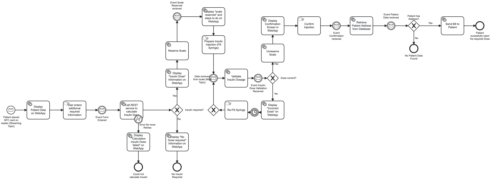

# Camunda Orchestrator
This is the orchestrator service for the whole process of managing an insulin dose from detection to administration. 

States of individual processes are saved in this service and should only be accessed by administrators. 

## Insulin Workflow


### Building the Application

```bash
# Build the project
mvn clean package
```

### Starting the Bridge

```bash
# Run with Maven
mvn spring-boot:run
```

You can access the camunda application via localhost and the port that was defined in the **application.yaml** file, default it is port **8090**. For more important information please consult the configuration file mentioned above. 

## Environment Restrictions
This project uses Camunda 7.20.0 community edition with Spring Boot.